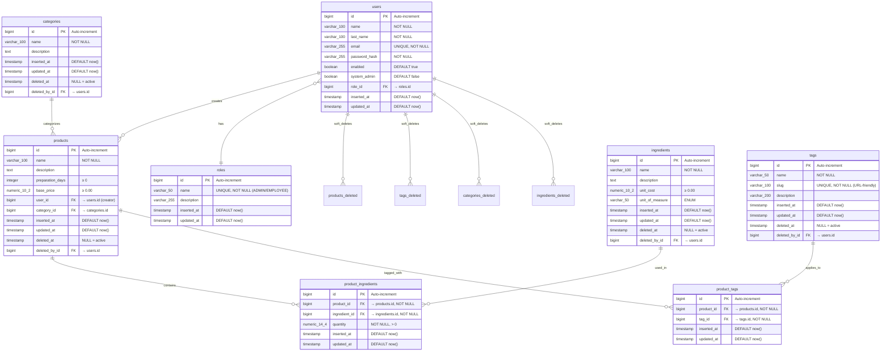

# Malva Pastry Shop - System Architecture

## Overview
This document describes the system architecture, design patterns, and architectural decisions for the Malva Pastry Shop backend.

**Architecture Style:** Layered + Domain-Driven Design (DDD)  
**Deployment:** Monolithic Spring Boot application  
**Future:** Dual-channel (Admin SSR + Public REST API)

---

## Table of Contents
1. [High-Level Architecture](#high-level-architecture)
2. [Domain-Driven Design](#domain-driven-design)
3. [Layer Architecture](#layer-architecture)
4. [Package Organization](#package-organization)
5. [Design Patterns](#design-patterns)
6. [Security Architecture](#security-architecture)
7. [API Strategy](#api-strategy)

---

## High-Level Architecture


---

## Domain-Driven Design


### Bounded Contexts

#### 1. Storefront Context (Public-Facing)
**Purpose:** Customer-facing product catalog  
**Entities:** Product, Category, Tag, ProductTag  
**Services:** ProductService, CategoryService, TagService  
**Exposure:** Will be exposed via REST API to React frontend

**Business Rules:**
- Products have categories and tags for organization/filtering
- Products implement soft-delete (can be restored)
- Tags have URL-friendly slugs
- Cannot delete tag if in use by products

#### 2. Inventory Context (Internal Operations)
**Purpose:** Internal production, recipes, and cost management  
**Entities:** Ingredient, ProductIngredient, UnitOfMeasure  
**Services:** IngredientService  
**Exposure:** Internal only, not exposed to public API

**Business Rules:**
- Ingredients track unit costs for profit analysis
- ProductIngredient defines recipes (quantity of each ingredient)
- Soft-delete prevents accidental data loss

#### 3. Auth Context (Shared)
**Purpose:** Authentication and authorization  
**Entities:** User, Role  
**Services:** UserService (implements UserDetailsService)  
**Exposure:** Admin-only, never public

**Business Rules:**
- Role-based access control (ADMIN, EMPLOYEE)
- BCrypt password hashing
- Session-based authentication for admin panel
- Future: JWT for public API

### Cross-Context Relationships


---

## Layer Architecture


### Layer Responsibilities

#### Presentation Layer
- **Controllers**: Handle HTTP requests/responses
- **Admin Controllers** (`@Controller`): Return Thymeleaf view names
- **API Controllers** (`@RestController`): Return JSON DTOs
- **Validation**: `@Valid` on request DTOs

#### Application Layer
- **Services**: Business logic, orchestration, transactions
- **DTOs**: Control data shape for different audiences
- **Mappers** (future): Entity ↔ DTO conversion

#### Domain Layer
- **Entities**: Business objects with identity
- **Value Objects**: Immutable objects (enums)
- **Business Rules**: Encoded in entity methods
- **No dependencies**: Pure business logic

#### Infrastructure Layer
- **Repositories**: Database queries via Spring Data JPA
- **Security**: Spring Security configuration
- **Utilities**: Helper classes (e.g., SlugUtil)

---

## Package Organization

```
com.malva_pastry_shop.backend/
│
├── controller/                 # Presentation
│   ├── admin/                  # SSR Controllers (Thymeleaf)
│   └── api/                    # REST Controllers (JSON)
│
├── service/                    # Application
│   ├── storefront/             # Public catalog logic
│   ├── inventory/              # Internal operations
│   └── UserService             # Auth service
│
├── dto/                        # Data Transfer
│   ├── request/                # Input validation
│   └── response/
│       ├── public/             # API responses
│       └── admin/              # Internal reports
│
├── domain/                     # Domain
│   ├── storefront/             # Public entities
│   ├── inventory/              # Internal entities
│   ├── auth/                   # User/Role
│   └── common/                 # Base classes
│
├── repository/                 # Infrastructure
├── config/                     # Configuration
│   ├── SecurityConfig
│   └── DataSeeder
│
└── util/                       # Utilities
    └── SlugUtil
```

### Package Naming Conventions

| Package      | Suffix           | Example                              |
| ------------ | ---------------- | ------------------------------------ |
| Entities     | None             | `Product`, `Tag`                     |
| Repositories | `Repository`     | `ProductRepository`                  |
| Services     | `Service`        | `ProductService`                     |
| Controllers  | `Controller`     | `ProductController`                  |
| DTOs         | `DTO`, `Request` | `ProductPublicDTO`, `ProductRequest` |

---


## Security Architecture


---

## API Strategy

### Current: Server-Side Rendering (SSR)
- **Technology:** Thymeleaf
- **Audience:** Admin users
- **Authentication:** Session-based
- **URL Pattern:** `/products`, `/categories`, etc.

### Future: REST API
- **Technology:** Spring REST + JSON
- **Audience:** React frontend (customers)
- **Authentication:** JWT (planned)
- **URL Pattern:** `/api/products`, `/api/categories`


## Technology Stack Alignment


## Entity Relationship Diagram



